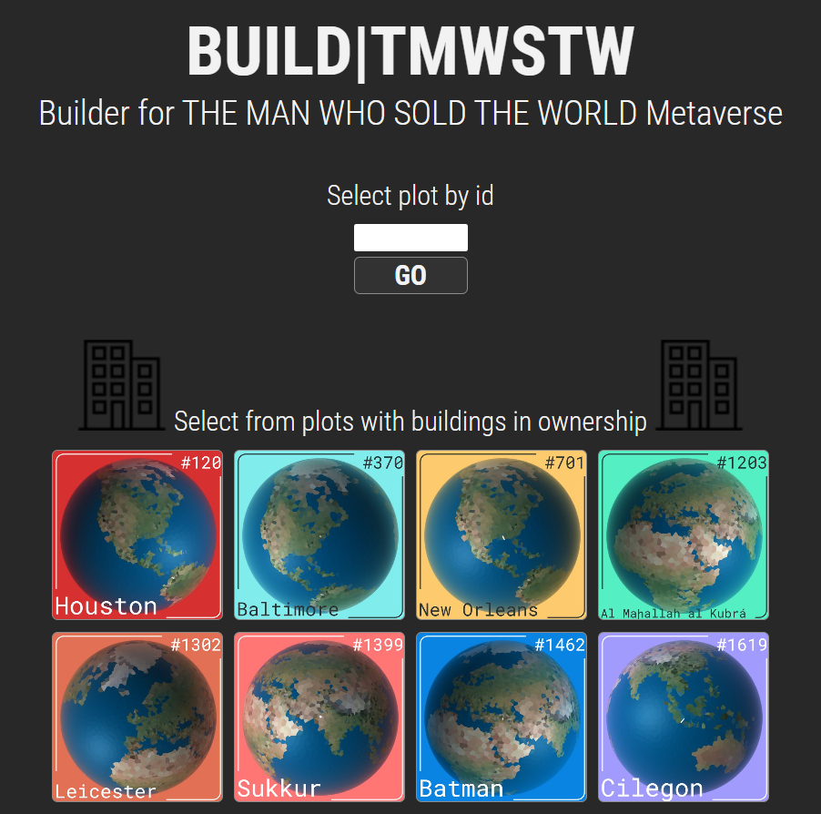

Based on this turd, here is a polished README for the `tMonkey` repository:

---

# tMonkey

This repository contains Tampermonkey scripts for enhancing the experience in the metaverse ["The Man Who Sold The World" (TMWSTW)](https://tmwstw.io/)

## Description

This collection of scripts is designed to improve various aspects of the TMWSTW metaverse by adding new functionalities and enhancing the user interface. These scripts are helpful for both developers and users who want to customize their experience in TMWSTW.

## Scripts

### Map_Plats.js

`Map_Plats.js` is a Tampermonkey script designed to enhance the TMWSTW metaverse experience by providing several features:

- Local Storage Initialization: Automatically initializes local storage items for tracking lifetime plots and user identification.
- Plot Observer: Monitors changes to the game's UI to update and display current plot information.
- Named Plats Fetching: Fetches and displays named plats from a remote server.
- API Requests: Makes HTTP requests to external APIs to fetch additional data.
- HUD Setup: Customizes the Heads-Up Display (HUD) to match the game's theme and provides additional information including faucet states and status.
- Keyboard Shortcuts: Adds keyboard shortcuts for various in-game functions, including toggling the Light and Dark mode.
- Changes darkcrosshairs to a  [Hearty Homies No. 9](https://opensea.io/assets/ethereum/0x495f947276749ce646f68ac8c248420045cb7b5e/17600979945986507276138947830454478538868967347557356188557200697473275789313)

### builderUI.js

`builderUI.js` is a Tampermonkey script designed to enhance the builder UI in the TMWSTW metaverse. This script adds images to the builder UI for a more visually appealing and informative experience:

- Builder Front Page Rework: Enhances the front page of the builder interface by adding images to the UI elements.
- Mutation Observer: Uses a MutationObserver to detect and handle changes in the UI, ensuring that the enhancements are applied dynamically.
- Named Plats Fetching: Fetches named plats from a remote server and uses this data to display corresponding images.
- Dynamic Image Display: Updates the background images of UI elements based on the plot information, providing a visual representation of the plots.

### clocks_blocks.js

`clocks_blocks.js` is a Tampermonkey script designed to enhance the gameplay experience in the TMWSTW metaverse. This script provides detailed information about clocks, blocks, and surrounding plats:

- API Data Fetching: Fetches data from various APIs to gather information about plats, block states, and faucet states.
- Dynamic UI Updates: Uses MutationObservers to detect changes in the game's UI and dynamically update the displayed information.
- Surrounding Plat Information: Displays information about <ins>touching plats</ins> neighboring plats, including their states and whether they are ready to claim '*''.
- Block Number Display: Fetches and displays the current ETC block number and average block time in the game's UI.
- Styled Information Display: Applies specific styles to plats based on their states (e.g., BOB(yellow), SLAG(red), GREASE(green), INK(blue)) to provide visual cues for mid or **high givers**.

### Shwamp worth_it.js

`worth_it.js` is a Tampermonkey script designed to provide real-time Ethereum Classic (ETC) price information and swap value calculations in the TMWSTW metaverse:

- ETC Price Fetching: Fetches the current price of Ethereum Classic (ETC) in USD from the Blockscout API.
- Swap Value Calculation: Calculates and displays the swap value in USD based on the ETC price and the amount of ETC being swapped.
- Dynamic Updates: Uses a MutationObserver to dynamically update the swap value when the input changes.
- UI Integration: Integrates seamlessly into the game's UI by appending a div with the ETC price and swap value to the liquidity controls container.

## ETC Worth It

The `etcworth.js` script provides the same functionality as `worth_it.js`, displaying the current price of ETC in USD and the swap value on the ETCSwap.

## Installation

To install any of these scripts, follow these steps:

1. Install the [Tampermonkey extension](https://www.tampermonkey.net/) for your browser.
2. Click on the script link you want to install:
   - [Map_Plats.js](https://raw.githubusercontent.com/katzworld/tMonkey/main/Map_Plats.js)
   - [builderUI.js](https://raw.githubusercontent.com/katzworld/tMonkey/main/builderUI.js)
   - [clocks_blocks.js](https://raw.githubusercontent.com/katzworld/tMonkey/main/clocks_blocks.js)
   - [worth_it.js](https://raw.githubusercontent.com/katzworld/tMonkey/main/worth_it.js)
   - [etcworth.js](https://raw.githubusercontent.com/katzworld/tMonkey/main/etcworth.js)

3. Tampermonkey will prompt you to install the script. Click "Install".
4. Check for Permission in Tampermonkey to @connect
5. Go out in world and use your new Augmented HUD

## Author

- **KaTZWorlD** - [@KaTZWorlD](https://github.com/katzworld)
- **COME FIND ME IN WORLD** [#370 Baltimore](https://play.tmwstw.io/?plot=370)
- **DISCORD IS THE WAY** >>>
